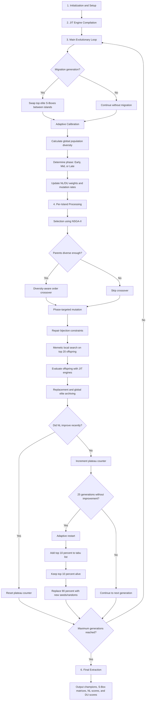

# S-Box Evolutionary Optimizer Workflow

This document summarizes the full optimization pipeline for evolving cryptographically strong S-Boxes using an island-based evolutionary algorithm, JIT-accelerated evaluation, adaptive mutation, local search, stagnation handling, and final champion extraction.

## 1. Initialization and Setup

The process begins by preparing the optimizer configuration and initial search population.

- Initialize hyperparameters:
  - Population size
  - Number of generations
  - Island count
- Set up supporting data structures:
  - Elite archive
  - Tabu memory
- Generate initial S-Boxes:
  - Robust AES-derived seeds
  - Randomly generated candidates
- Distribute S-Boxes across `N` islands.

## 2. JIT Engine Compilation

The core evaluation kernels are compiled once before the main evolutionary loop starts.

- Compile the Fast Walsh-Hadamard Transform (FWHT).
- Compile the Difference Distribution Table (DDT) evaluator.
- Run the initial fitness evaluation for all islands.

## 3. Main Evolutionary Loop

The optimizer repeats the following process from generation `1` to generation `N`.

### 3.1 Migration Check

The algorithm periodically checks whether the current generation is scheduled for migration.

- If migration is enabled for the current generation:
  - Swap top elite S-Boxes between islands.
- Otherwise:
  - Continue without migration.

### 3.2 Adaptive Calibration

The optimizer adjusts its behavior according to the current population state.

- Calculate global population diversity.
- Determine the current evolutionary phase:
  - Early phase
  - Mid phase
  - Late phase
- Update current optimization weights:
  - Non-linearity (NL)
  - Differential uniformity (DU)
- Update mutation rates.

## 4. Per-Island Processing

Each island independently evolves its own subpopulation during every generation.

### 4.1 Selection

- Select parent candidates using NSGA-II.

### 4.2 Crossover

- Apply diversity-aware order crossover.
- Trigger crossover only when parents are diverse enough.

### 4.3 Mutation

Mutation behavior changes depending on the evolutionary phase.

- Exploration phase:
  - Use aggressive multi-bit flips.
- Exploitation phase:
  - Hunt for weak bits.
  - Swap weak positions to improve the candidate.

### 4.4 Constraint Check

- Repair bijection constraints.
- Fix duplicates to ensure each S-Box remains a valid 8-bit permutation map.

### 4.5 Memetic Step

- Apply intense local search.
- Hill-climb the top 20 offspring to maximize non-linearity.

### 4.6 Evaluation

- Run JIT-compiled engines on new offspring.
- Compute fitness using:
  - Maximum NL
  - Minimum DU
  - Minimum weak-count score

### 4.7 Replacement and Archiving

- Merge parents and offspring.
- Select the best candidates to keep in each island.
- Send top performers to the global elite archive.

## 5. Stagnation and Restart Logic

The optimizer monitors whether the best non-linearity score has improved recently.

- If the NL score improved:
  - Reset the plateau counter.
  - Continue to the next generation.
- If the NL score did not improve:
  - Increment the plateau counter.
  - Check whether the optimizer has gone 25 generations without improvement.

When the plateau counter reaches 25 generations, an adaptive restart is triggered:

- Add the current top 10 percent to the tabu list.
- Keep the top 10 percent of the current population alive.
- Replace the remaining 90 percent with new seeded or random candidates.

After this step, the loop returns to the main evolutionary process until the maximum generation count is reached.

## 6. Final Extraction

When the evolutionary loop completes, the optimizer extracts and reports the best discovered candidates.

- Extract the last-generation champion from the active islands.
- Extract the all-time best S-Box from the elite archive.
- Output:
  - Final S-Box matrices
  - Final NL scores
  - Final DU scores

## Workflow Diagram

